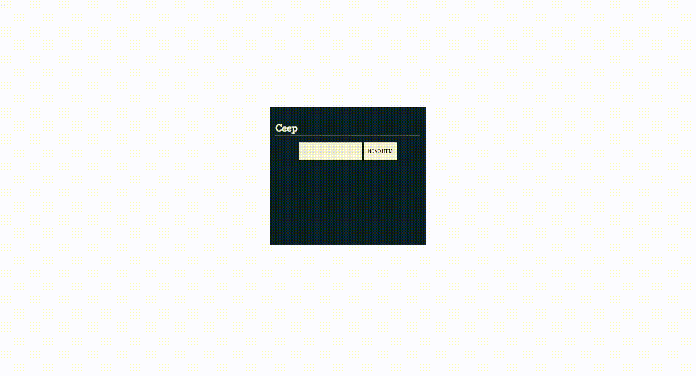

  

Este repositório é destinado ao projeto que desenvolvi com base no curso "JS na Web: Manipule o DOM com JavaScript" da Alura.

## Sobre

O curso tem como objetivo ensinar o funcionamento do DOM, por meio da manipulação para alterar, adicionar, remover e criar novos elementos na árvore de objetos. 

Além disso, foi demonstrado como utilizar a componentização para organização do projeto, bem como o sistema de módulos do JavaScript para proteção dos arquivos.

## Tecnologias 

- [Visual Studio Code](https://code.visualstudio.com/)
- [HTML5](https://html.com/)
- [CSS3](https://www.w3.org/Style/CSS/Overview.en.html)
- [JavaScript](https://www.javascript.com/)

## Aprendizado

- Manipulação de **DOM** com JavaScript;
- Seleção do valor do _input_ utilizando a propriedade de _value_;
- Utilização do método _querySelector_ para selecionar elementos na árvore do DOM, especificamente para busca do seletor _"Data Attributes"_;
- Funcionamento da estrututra do DOM; 
- Utilização do método _addEventListener_ para escutar eventos no elemento;
- Criação de templates utilizando _"Template Strings"_;
- Como trabalhar com _appendChild_; 
- Criação de elementos utilizando o método _createElement_;
- Adição de classe CSS utilizando o método _toggle_;
- Utilização do atributo _parentElement_ para subir um elemento na árvore do DOM; 
- Encontrar o alvo do evento utilizando a propriedade _target_; 
- Utilização do IIFE;
- Eventos;
- Conceito de componente; 
- Uso do _export default_; 
- Chamada do componente através do _import_;
- Remoção de elementos do DOM com o método _remove_;
- Compreensão acerca do Same Origin Police e CORS.

## Resultado

Como resultado do ensinado, foi possível desenvolver o seguinte to-do-list, nomeado de **CEEP**: 

    

## Status do curso e projeto

**Concluído.**
